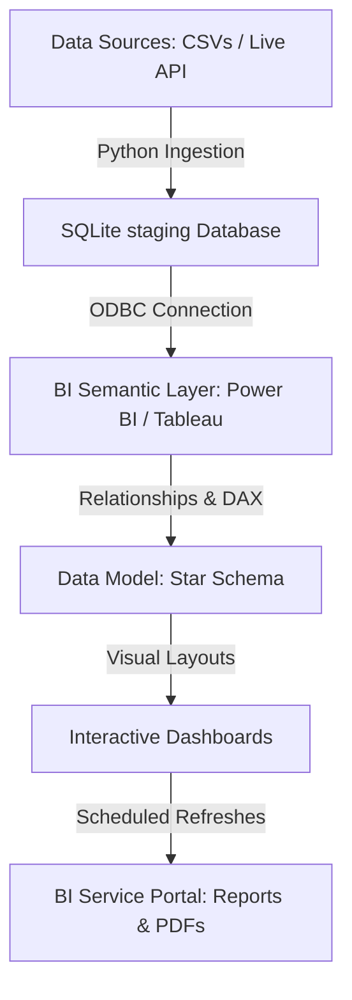

# Business Intelligence (BI) Setup Roadmap — Mutual Fund Analytics

This roadmap outlines the end-to-end strategic path to set up a professional-grade **Business Intelligence (BI) Analytics Platform** for the Bluestock Mutual Fund Capstone project. It covers data architecture, ETL pipeline automation, dimensional modeling, visualization, and dashboard deployment.

---

---

## Phase 1: Data Infrastructure & Storage (Setup)

### Step 1.1: Database Optimization
- Connect to the central database (`bluestock_mf.db`).
- Verify table definitions and column constraints (ensure datatypes are correctly mapped: dates as text `YYYY-MM-DD`, numeric metrics as `REAL` or `INTEGER`).
- Create and execute indexing scripts for primary keys (`amfi_code`, `date`) and composite foreign keys to accelerate query performance during BI refreshes.

### Step 1.2: Establish BI Connection
- Install and configure the **SQLite ODBC Driver** on the reporting environment.
- Create a **System DSN (Data Source Name)** pointing to the absolute path of `bluestock_mf.db`.
- Establish the data gateway connection in Power BI Desktop or Tableau using the ODBC connector.

---

## Phase 2: Dimensional Modeling & Semantic Layer

### Step 2.1: Design the Star Schema
Design a clean **Star Schema** to enable fast aggregation and ensure compatibility with BI performance standards:
- **Dimension Tables (Parents):**
  - `dim_fund`: Holds scheme metadata (category, sub-category, plan, benchmark, expense ratio).
  - `dim_date`: Calendar master table (year, month, day, quarter, day name) to handle time-series intelligence.
- **Fact Tables (Children):**
  - `fact_nav`: Daily NAV logs.
  - `fact_transactions`: Transaction-level investor history.
  - `fact_performance`: Calculated performance indicators.
  - `fact_aum`: AUM logs by fund house.
  - `fact_monthly_sip_inflows` & `fact_category_inflows`: Monthly industry aggregations.

### Step 2.2: Establish Key Relationships
Create single-direction filters from parent dimension tables to child fact tables:
- `dim_fund[amfi_code] ───(1:*)───> fact_nav[amfi_code]`
- `dim_fund[amfi_code] ───(1:*)───> fact_transactions[amfi_code]`
- `dim_date[date]      ───(1:*)───> fact_nav[date]`
- `dim_date[date]      ───(1:*)───> fact_transactions[transaction_date]`

---

## Phase 3: Analytical Measures & Calculation Layer

Create the core metrics repository (using DAX in Power BI or calculated fields in Tableau):

### Step 3.1: Define KPI Metrics
- **Total AUM**: Value of AUM for the latest reported date.
- **Monthly SIP Inflow**: Sum of inflows for the latest calendar month.
- **Total Folios**: Industry-wide account count for the latest period.
- **Active Schemes**: Distinct count of unique mutual fund schemes.

### Step 3.2: Implement Performance & Risk Ratios
- **CAGR Return**: Annualized returns over 1yr, 3yr, and 5yr windows.
- **Volatility**: Annualized standard deviation of daily returns: $\sigma_{daily} \times \sqrt{252}$.
- **Sharpe Ratio**: Risk-adjusted excess return ratio over the risk-free rate proxy (6.5% repo rate): $\frac{R_p - R_f}{\sigma_p}$.
- **Sortino Ratio**: Same excess return ratio, but using downside volatility (standard deviation of negative returns only).
- **Alpha & Beta**: Daily intercepts and slopes calculated via regression against the market benchmark (`NIFTY100`).

---

## Phase 4: Visualization & UX Design (4-Page Dashboard)

Structure the dashboard reports into four thematic views to cater to executive, analyst, and retail audiences:

### Page 1: Industry Overview (Executive Summary)
- **Primary Goal:** Display industry scale and AMC market shares.
- **Visuals:**
  - KPI Cards for Total AUM, SIP Inflows, Folios, and Schemes.
  - Line chart showing industry AUM growth over time (2022-2025).
  - Horizontal bar chart of AUM by AMC, highlighting market leaders.

### Page 2: Fund Performance (Analyst Workspace)
- **Primary Goal:** Analyze fund returns, risk levels, and benchmark alpha.
- **Visuals:**
  - Scatter plot of return vs volatility (bubble size = AUM).
  - Sortable fund scorecard table showing return, Sharpe, Sortino, Alpha, Beta, Drawdowns, and Expense Ratios.
  - Interactive line chart plotting NAV vs Benchmark index for selected funds.
  - Slicers: AMC, Fund Category, Plan (Direct/Regular).

### Page 3: Investor Analytics (Retail & Demographics)
- **Primary Goal:** Track demographic participation, transactional split, and geographic inflows.
- **Visuals:**
  - Horizontal bar chart of total SIP amount by State.
  - Donut chart showing transaction vehicle split (SIP vs Lumpsum vs Redemption).
  - Bar chart showing average monthly SIP ticket size by age group.
  - Slicers: State, Age Group, City Tier (T30 vs B30).

### Page 4: SIP & Market Trends (Market Intelligence)
- **Primary Goal:** Link SIP retail behavior with stock market indices and track category inflows.
- **Visuals:**
  - Dual-axis chart combining monthly SIP inflows (bars) and Nifty 50 Index performance (line).
  - Net monthly category inflow intensity heatmap.
  - Bar chart showing the top 5 sectors or categories by net inflows.

---

## Phase 5: Interactivity, Tooltips, and Drilling

### Step 5.1: Drill-Through Actions
- Enable drill-through from the main **Scorecard Table** (Page 2) to a detailed **NAV Performance Detail Page**. Right-clicking a fund allows analysts to deep-dive into its daily historical performance.

### Step 5.2: Report Tooltips & Cross-filtering
- Customize report tooltips to display detailed fund managers, expense structures, and benchmark information upon hovering over scatter plot bubbles.
- Ensure cross-filtering is turned on for all charts to allow interactive filtering of demographics when clicking on states or age bars.

---

## Phase 6: ETL Automation & Deployment

### Step 6.1: ETL Automation (Gateway Refresh)
- Configure an automatic data ETL pipeline using `schedule_etl.py` to ingest new CSV data and daily live NAV logs.
- Set up **On-Premises Data Gateway** in Power BI Service to connect the cloud workspace with the local SQLite database.
- Schedule gateway refreshes twice daily (e.g., at 9 AM and 6 PM after NAV release) to maintain real-time data integrity.

### Step 6.2: Report Distribution & Exports
- Publish the dashboard to Power BI Service / Tableau Cloud.
- Set up automated scheduled exports:
  - Generate PDF reports weekly for executive reviews.
  - Export tabular data to CSV (`fund_scorecard.csv` and `alpha_beta.csv`) for risk analysts.
  - Configure alerts for threshold crossings (e.g., when monthly SIP inflows cross a new ₹35K Cr milestone).
